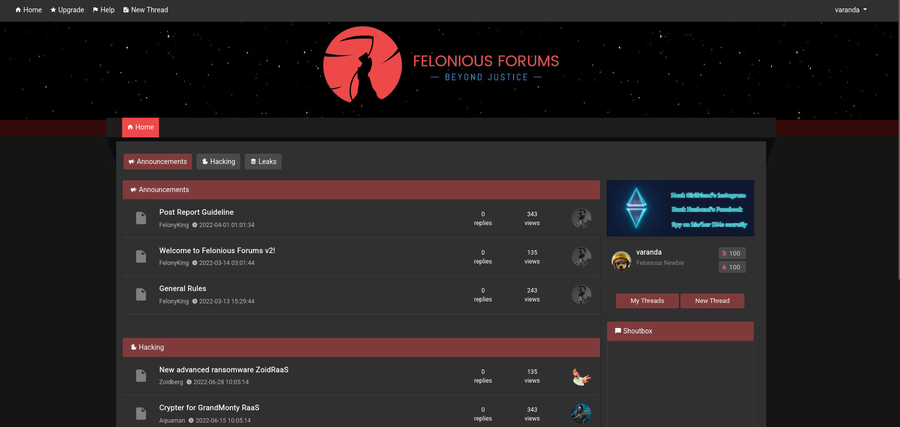
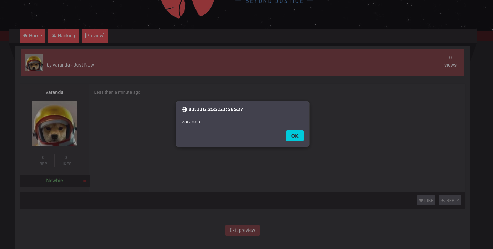
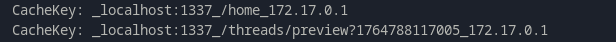
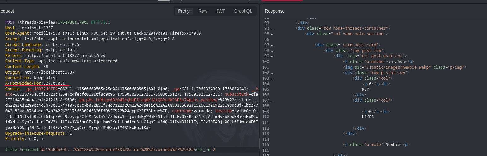
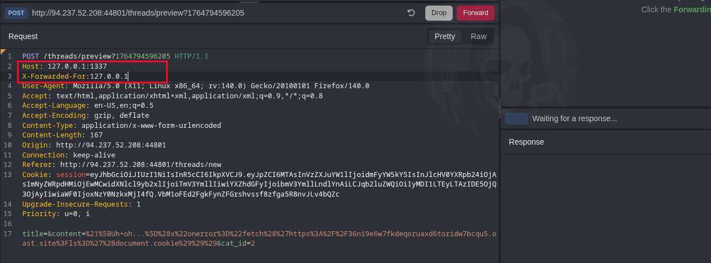
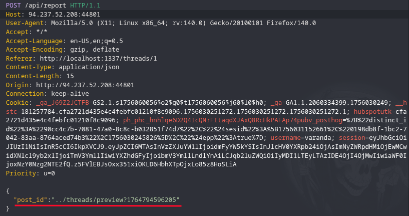
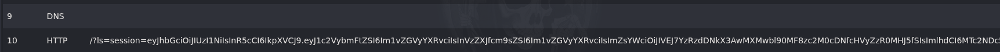

# Felonious Forums - Business CTF 2022

### ===== Challenge =====
- Our threat intelligence has traced a reseller of the GrandMonty Ransomware linked with the Monkey Business group to this illegal forums platform. We need you to investigate the platform to find any security loopholes that can provide us access to the platform.


### ===== Analysis =====
- We have to register a user, and after doing so and logging in, we are presented with this page:



- I can read, add, and report posts
- I start by looking at where the flag is, so I can have a final goal:
```js
const visitPost = async (id) => {
    try {
		const browser = await puppeteer.launch(browser_options);
		let context = await browser.createIncognitoBrowserContext();
		let page = await context.newPage();

		let token = await JWTHelper.sign({ username: 'moderator', user_role: 'moderator', flag: flag });
		await page.setCookie({
			name: "session",
			'value': token,
			domain: "127.0.0.1:1337"
		});

		await page.goto(`http://127.0.0.1:1337/report/${id}`, {
			waitUntil: 'networkidle2',
			timeout: 5000
		});
		await page.waitForTimeout(2000);
		await browser.close();
    } catch(e) {
        console.log(e);
    }
};
```
- I need to **steal the moderator's JWT** and decode it to get the flag, so this challenge will probably have some form of **XSS (Cross-Site Scripting)**

- I start taking a look at potential XSS sinks and find these endpoints:

```js
router.post('/threads/preview', AuthMiddleware, routeCache.cacheSeconds(30, cacheKey), async (req, res) => {
	const {title, content, cat_id} = req.body;

	if (cat_id == 1) {
		if (req.user.user_role !== 'Administrator') {
			return res.status(403).send(response('Not Allowed!'));
		}
	}

	category = await db.getCategoryById(parseInt(cat_id));
	console.log("Create filterInput(content): " + filterInput(content));
	safeContent = makeHTML(filterInput(content));
	console.log("Create makeHTML(filterinput(content)): " + safeContent);

	return res.render('preview-thread.html', {category, title, content:safeContent, user:req.user});
});
```

```js
router.post('/api/threads/reply', AuthMiddleware, async (req, res) => {
	const { id, comment } = req.body;
	const html_content = makeHTML(comment);
	console.log("Reply makeHTML(content): " + html_content);
	console.log("Reply filterInput(makeHTML(content)): " + filterInput(html_content));
	if(!isNaN(parseInt(id))) {
		return db.postThreadReply(req.user.id, parseInt(id), filterInput(html_content))
			.then(() => {
				res.send(response('Thread reply posted successfully!'));
			})
			.catch((e) => {
				res.status(500).send(response('Failed to post thread reply!'));
			});
	} else {
		return res.status(500).send(response('Missing required parameters!'));
	}
});
```

- The `makeHTML()` function converts Markdown to HTML and the `filterinput()` function uses **DOMPurify** to sanitize the input
- Looking at how they are called in `/threads/preview`, I see that the input is being passed into `inpufilter()` and then into `makeHTML()`. This doesn't make sense, since the **input is markdown, DOMPurify will do nothing**.
- I have to find a markdown payload that when converted to HTML becomes a XSS payload:
- I find one that works in https://jakobthe.dev/posts/exploiting-xss-via-markdown/ :
	- `)` becomes ``



- The first step is done! Now I need to make the moderator visit the preview page. But how? 
- Usually when I need soewone to see a page that is associated with my session it's **either cache stuff or a session fixation attack**
- Taking a second look at the code I find this:
```js
const cacheKey = (req, res) => {
	return `_${req.headers.host}_${req.url}_${(req.headers['x-forwarded-for'] || req.ip)}`;
}
(...)
router.get('/threads/preview', AuthMiddleware, routeCache.cacheSeconds(30, cacheKey), async (req, res) => {
	return res.redirect('/threads/new');
});
```
- There's a caching mechanism and the key format is: `_{Host_header}_{url}_{X-Forwarded-For_header || IP}`
- This means that I can change the cache key by **changing the Host and X-Forwarded-For headers**! I can make it so that my preview gets cached with the same key that the moderator will get when he tries to access `/threads/preview` (**Cache Poisoning**)
- Testing locally (added debug statements):




- Now I need to make the moderator visit the preview page. 

```js
router.post('/api/report', async (req, res) => {
	const { post_id } = req.body;
	if (botVisiting) return res.status(403).send(response('Please wait for the previous report to process first!'));
	if(post_id) {
		botVisiting = true;
		return bot.visitPost(post_id)
			.then(() => {
				botVisiting = false;
				return res.send(response('Report received successfully!'));
			})
			.catch(e => {
				console.log(e);
				botVisiting = false;
				return res.status(403).send(response('Something went wrong, please try again!'));
			})
	}
	return res.status(500).send(response('Missing required parameters!'));
});
(...)
//inside visitPost function
await page.goto(`http://127.0.0.1:1337/report/${id}`, {
			waitUntil: 'networkidle2',
			timeout: 5000
		});
```

- I notice that **there's no verification of the reported post's id value**, and that it is directly passed into the URL that the moderator will visit. That means I can try a **Path Traversal** attack.

### ===== Exploitation =====
- I need to adapt the XSS payload so that it sends the moderator's credentials to my server.
- `))`
- Then I need to create a preview and intercept the request to change the headers so that the page gets cached with the same key as the moderator will use, forcing the server to give him our malicious page:

- Then I have 30 seconds to submit a report request with the Path Traversal payload in the `post_id` argument:

- And BOOM! I receive the moderator's session on my server (Caido's 'Quick SSRF' plugin, the GOAT):



- **Flag: HTB{c4st3d_p01s0n_t0_3sc4p3_purg4t0ry}**

writeup by *varanda* - 03/12/2025
