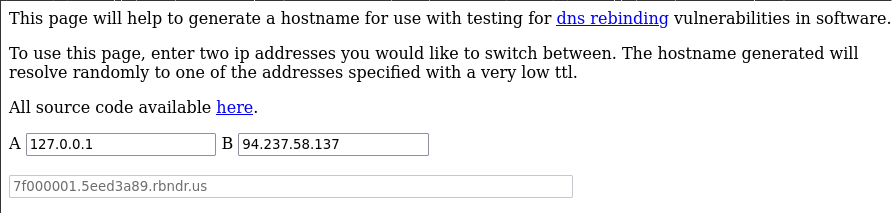
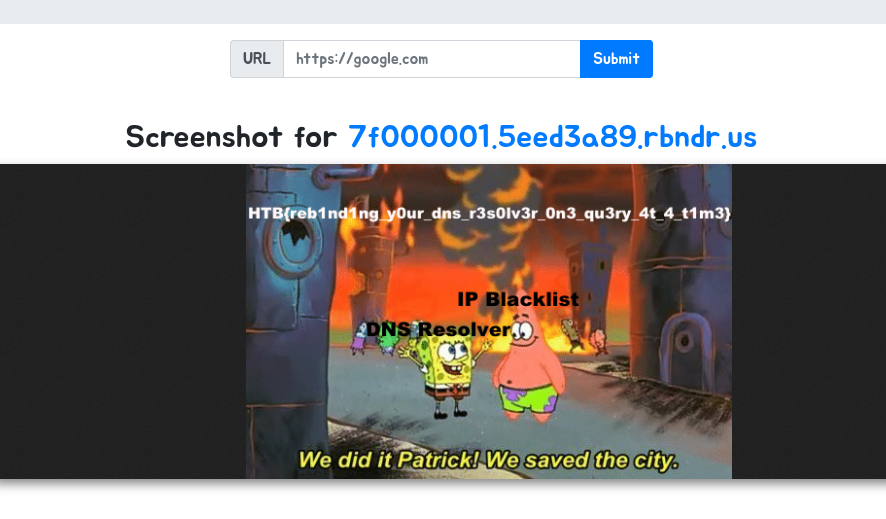

# baby CachedView

### ===== Challenge =====
- I made a service for people to cache their favourite websites, come and check it out! But don't try anything funny, after a recent incident we implemented military grade IP based restrictions to keep the hackers at bay...

### ===== Analysis =====
- We are presented with this page where I can submit a URL.


- I start by looking at where the flag is, so I can have a final goal:
```python
@web.route('/flag')
@is_from_localhost
def flag():
    return send_file('flag.png')
```
- I need to see the contents of the `/flag` page, and the request needs to come from the localhost. I need to somehow do **SSRF (Server-Side Request Forgery)**.

- Let's look at the code:

```python
def cache_web(url):
    scheme = urlparse(url).scheme
    domain = urlparse(url).hostname

    if not domain or not scheme:
        return flash(f'Malformed url {url}', 'danger')
        
    if scheme not in ['http', 'https']:
        return flash('Invalid scheme', 'danger')

    def ip2long(ip_addr):
        print("IP Socket:",socket.inet_aton(ip_addr))
        return struct.unpack('!L', socket.inet_aton(ip_addr))[0]
    
    def is_inner_ipaddress(ip):
        ip = ip2long(ip)
        return ip2long('127.0.0.0') >> 24 == ip >> 24 or \
                ip2long('10.0.0.0') >> 24 == ip >> 24 or \
                ip2long('172.16.0.0') >> 20 == ip >> 20 or \
                ip2long('192.168.0.0') >> 16 == ip >> 16 or \
                ip2long('0.0.0.0') >> 24 == ip >> 24
    if is_inner_ipaddress(socket.gethostbyname(domain)):
        return flash('IP not allowed', 'danger')
    
    return serve_screenshot_from(url, domain)
```

- There is a SSRF filter in place, and it's pretty strong. It converts the IP into a long and then checks if it belongs in any of the private IP subnets. I still tried a lot of SSRF bypass payloads but to no avail.
- When almost all hope was lost, I looked at the placeholder flag that was in the source code:


- Rebinding? I google 'rebinding attacks' and discover **DNS Rebinding**
- Basically it's an attack in which I change the IP to which my domain is pointing in order to perform a **TOCTOU (Time-Of-Check-Time-Of-Use) race condition** so that after the SSRF validation it changes to 127.0.0.1. When the server queries the IP of the domain again in `serve_screenshot_from(url, domain)`, it will receive 127.0.0.1 from the DNS server!


### ===== Exploitation =====
- In order to do this I need to have a domain that either changes after each query or **changes in very short intervals**. The website https://lock.cmpxchg8b.com/rebinder.html does the latter.



- Now I just need to input the generated domain into the app:
	- `http://7f000001.5eed3a89.rbndr.us/flag`
- After a few tries I get:



- **Flag: HTB{reb1nd1ng_y0ur_dns_r3s0lv3r_0n3_qu3ry_4t_4_t1m3}**

#### ===== Alternative Solution =====
- This alternative solution came to my mind while I was writing this.
- Host this payload and make the website fetch it:
```html
  <body>
    <iframe referrerpolicy="no-referrer" src="http://127.0.0.1/flag"></iframe>
  </body>
```
- The "no-referrer" is needed because the `is_from_localhost()` function ensures that there is no Referrer header:
```python
def is_from_localhost(func):
    @functools.wraps(func)
    def check_ip(*args, **kwargs):
        if request.remote_addr != '127.0.0.1' or request.referrer:
            return abort(403)
        return func(*args, **kwargs)
    return check_ip
```
writeup by *varanda* - 04/12/2025
